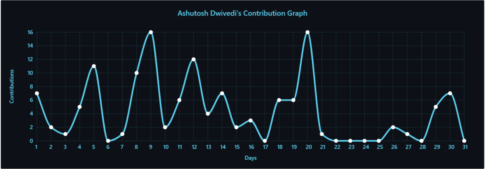
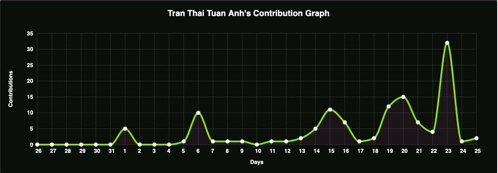

<p align="center">
    
</p>

<h1 align="center">CoffeeActivityTools</h1>

## Table of contents

-   [Table of contents](#table-of-contents)
-   [How to Use](#how-to-use)
    -   [Attention ⚠](#attention-)
-   [Use themes](#use-themes)
-   [Available Themes](#available-themes)
-   [Customization](#customization)
    -   [Common Options](#common-options)
-   [Deploy on your own Replit instance](#deploy-on-your-own-replit-instance)
    -   [Follow the steps](#follow-the-steps)
-   [Deploy on your own Vercel instance](#deploy-on-your-own-vercel-instance)
    -   [First Method](#first-method)
    -   [Second Method](#second-method)
    -   [Finally](#finally)
-   [Contributing](#contributing)
-   [Core Team 💻](#core-team-)
-   [Contributors ✨](#contributors-)
-   [Resources Used to build this project](#resources-used-to-build-this-project)
-   [Star History](#star-history)
    -   [Made with ❤ and TypeScript ](#made-with--and-typescript-)

## Instructions 

Just paste the following URL in your profile readme and you are good to go.

**Pass your `username` in the URL**

```md
[](https://github.com/CoffeeBit/CoffeeActivityTools)
```

### [Attention ⚠](#Deploy-on-your-own-heroku-instance)

## Use themes

_`username=Coffee&theme=theme_name`_

```md
[](https://github.com/CoffeeBit/CoffeeActivityTools)
```

[Manual Customization](#customization) is also available

## Customization

Customize the appearance of your Activity Graph however you want with URL params.

#### Common Options

|   Arguments    |                  Description                  |       Type of Value        |
| :------------: | :-------------------------------------------: | :------------------------: |
|   `bg_color`   |            card's background color            |   hex code (without `#`)   |
|    `color`     |            graph card's text color            |   hex code (without `#`)   |
| `title_color`  |           graph card's title color            |   hex code (without `#`)   |
|     `line`     |              graph's line color               |   hex code (without `#`)   |
|    `point`     |         color of points on line graph         |   hex code (without `#`)   |
|  `area_color`  |       color of the area under the graph       |   hex code (without `#`)   |
|     `area`     |          shows area under the graph           | boolean (default: `false`) |
| `hide_border`  |   makes the border of the graph transparent   | boolean (default: `false`) |
|  `hide_title`  |       sets the title to an empty string       | boolean (default: `false`) |
| `custom_title` |          set the title to any string          |           string           |
|    `theme`     | name of [available themes](#available-themes) |           string           |
|    `radius`    |            border radius of graph             |  number (0-16 inclusive)   |
|    `height`    |              height of the graph              | number (200-600 inclusive) |

⚠ **For `custom_title` please make sure that you are using %20 for spaces**

Example:

**`custom_title=This%20is%20a%20title`**

```md
[](https://github.com/CoffeeBit/CoffeeActivityTools)
```

**Example:**

```md
[](https://github.com/CoffeeBit/CoffeeActivityTools)
```

## Available Themes

|            Name            |                            Preview                             |
| :------------------------: | :------------------------------------------------------------: |
| **Default (cotton candy)** |         |
|         **react**          |           |
|       **react-dark**       |      |
|         **github**         |          |
|     **github-compact**     |  |
|         **xcode**          |           |
|         **rogue**          |           |
|         **merko**          |           |
|          **vue**           |             |
|      **tokyo-night**       |     |
|     **high-contrast**      |   |

For more themes click [here](https://github.com/CoffeeBit/CoffeeActivityTools/blob/main/THEMES.md)

## Deploy on Replit

<details>
<summary><b>Step-by-step instructions for deploying to Replit (from UI)</b></summary>

#### Follow the steps

1. Sign in to Replit or create a new account at https://replit.com
2. Click the Deploy button below

 <a href="https://repl.it/github/Coffee/CoffeeActivityTools">
   
 </a>

3. On the page that comes up, choose language as `Node.js` and then click `Import from GitHub` Button

    

4. Visit [this link](https://github.com/settings/tokens/new?description=GitHub%20Readme%20Activity%20Graph) to create a new Personal Access Token
5. Scroll to the bottom and click "**Generate token**"
6. Wait clone done and add `Secrets` with your `Github token`

    

7. Click the green `RUN` button on top, the console will run and at last the url will shows on the right
8. Now just add the following to your profile readme and you're good to go

```

```

</details>

## Deploy on Vercel (Recommended)

<details>
<summary><b>Step-by-step instructions for deploying to Vercel (from UI)</b></summary>

#### First Method

1.  Go to [vercel.com](https://vercel.com/).
2.  Click on `Log in`.
    
3.  Sign in with GitHub by pressing `Continue with GitHub`.
    
4.  Sign in to GitHub and allow access to all repositories if prompted.
5.  Fork this repo.
6.  Go back to your [Vercel dashboard](https://vercel.com/dashboard).
7.  To import a project, click the `Add New...` button and select the `Project` option.
    
8.  Click the `Continue with GitHub` button, search for the required Git Repository and import it by clicking the `Import` button.
    
9.  Create a personal access token (PAT) [here](https://github.com/settings/tokens/new) and enable the `repo` permissions (this allows access to see private repo stats).
    
10. Add the PAT as an environment variable named `TOKEN`.
    
11. Click deploy, and you're good to go. See your domains to use the API!

#### Second Method

Alternatively, click the button below and follow the instructions.

[](https://vercel.com/import/project?template=https://github.com/CoffeeBit/CoffeeActivityTools)

After the deployment is complete:

1. Click the `Continue to Dashboard` button
   
2. In the `Settings` tab, click on `Environment Variables` and follow steps `9.` and `10.` of `First Method`.
   
3. Go to `Deployments` tab and redeploy the project.
   

#### Finally

Now just add the following to your profile readme and you're good to go.

```md

```

</details>

## Star History

[](https://star-history.com/#Coffee/CoffeeActivityTools&Timeline)

### Made with ❤ and TypeScript 
